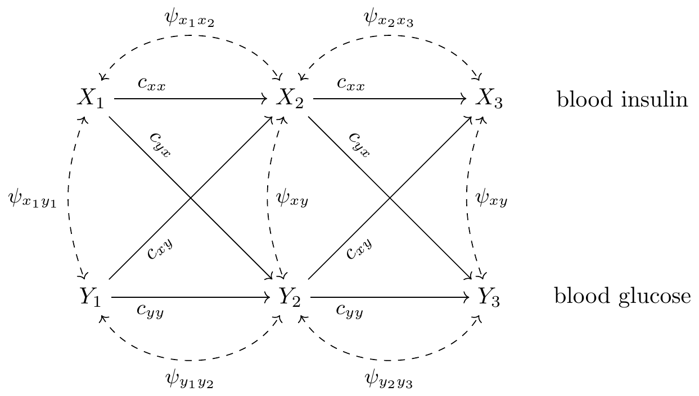
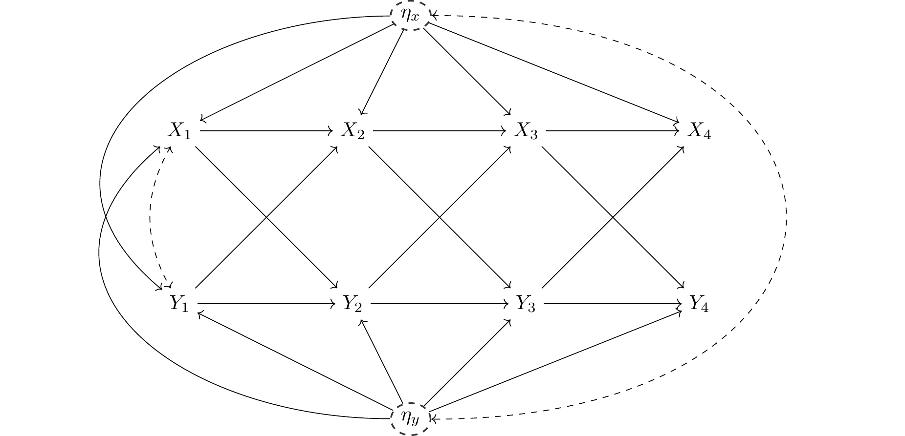
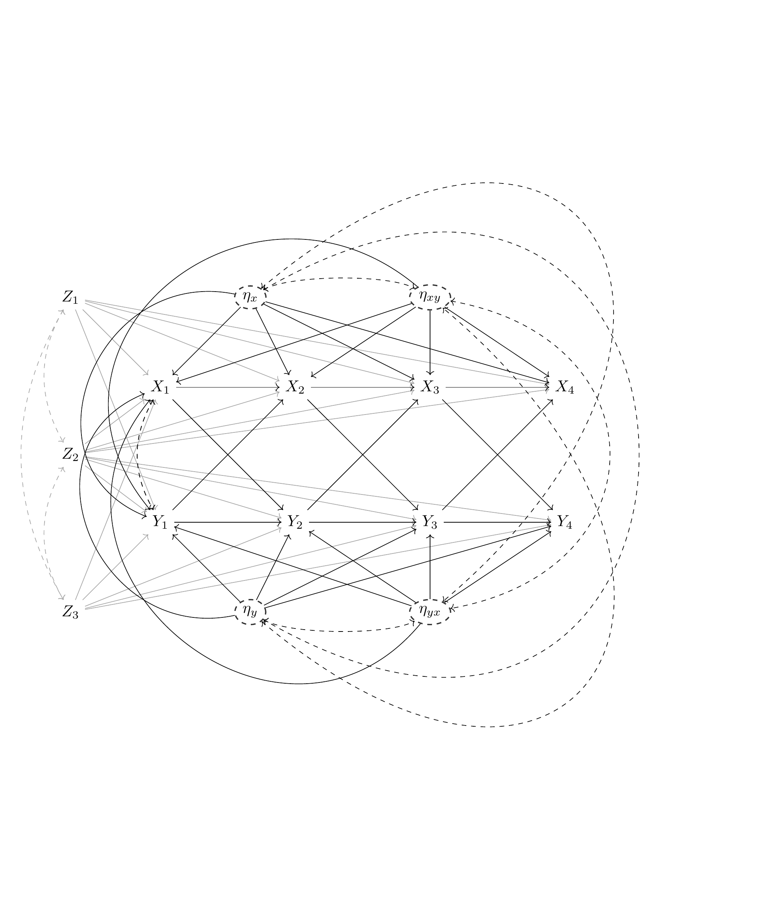
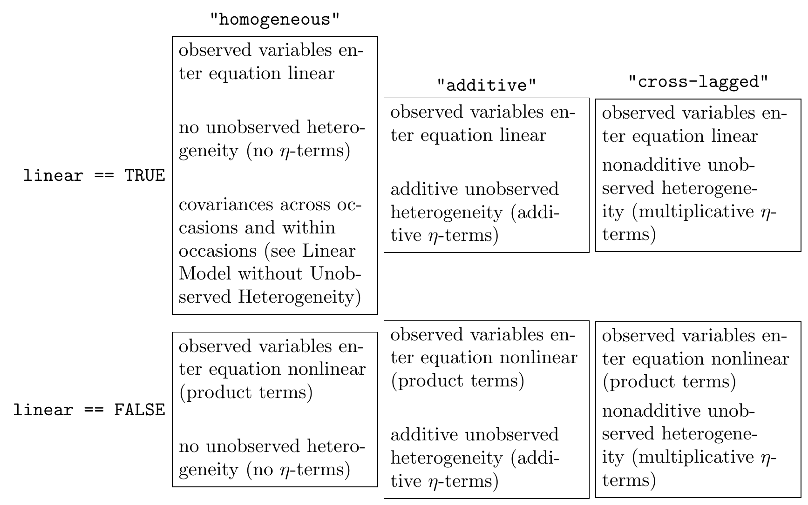

The panelSEM Package
================
Christian Gische

<!-- README.md is generated from README.Rmd. Please edit that file -->

## Installing the Package

The current version of the `panelSEM` package can be found on
[GitHub](https://github.com/christian-gische/panelSEM) and can be
installed directly via `RStudio` using the following code:[^1]

``` r
# install the causalSEM package from GitHub
devtools::install_github("christian-gische/panelSEM")

# load lavaan and OpenMx
library(lavaan)
library(OpenMx)
```

## Purpose of the Package

The purpose of the package is to fit dynamic panel data models to data
and obtain parameter estimates. The class of models that can be
estimated ranges from simple linear models (e.g., the cross-lagged panel
model) to complex nonlinear nonadditive models with observed and
unobserved effect heterogeneity. The following figures display the
causal graphs of three prototypical models with increasing complexity.

### Linear Model without Unobserved Heterogeneity

The following figure displays the causal structure of a linear
cross-lagged panel model and is taken from Gische & Voelkle (2022).



### Linear Model with Additive Unobserved Heterogeneity

The following figure displays the causal structure of a dynamic panel
data model with additive heterogeneity and is taken from Gische et al.
(2021).



### Nonlinear Model with Nonadditive Unobserved Heterogeneity

The following figure displays the causal structure of a nonlinear
dynamic panel data model with nonadditive heterogeneity and is taken
from Gische et al. (2023)



## The `fit_panel_sem`-Function

The central function of the package is the `fit_panel_sem`-function
which allows users to (i) specify a model, (ii) provide the data, and
(iii) fit the model to the data. The following code chunk displays a
minimal example of a function when only mandatory arguments are
specified.

``` r
panelSEM_object <- fit_panel_sem(data = data,
                                 time_varying_variables = time_varying_variables,
                                 time_invariant_variables = time_invariant_variables,
                                 linear = linear,
                                 heterogeneity = heterogeneity)
```

The mandatory arguments are listed below and will be explained in detail
throughout the subsequent sections:

- `data`: the data set  
- `time_varying_variables`: a list of time-varying observed variables
- `time_invariant_variables`: a list of time-invariant observed
  covariates  
- `linear`: an argument specifying if the model is linear or nonlinear  
- `heterogeneity`: an argument specifying the type of unobserved
  heterogeneity

### The `data` argument

The data set needs to be provided as a `.txt`-file and organized in the
wide format.

### The `time_varying_variables` argument

### The `time_invariant_variables` argument

### The `linear` and the `unobserved_heterogeneity` argument



Additionally to the basic combinations displayed in the figure above, a
model can exhibit more than one type of unobserved heterogeneity. Thus,
the argument `heterogeneity` can take the value
`heterogeneity == c("additive","cross-lagged")`. We now illustrate the
different types of equations.

### Linear, homogeneous

$$
Y_{t} = c_{yx}X_{t-1}+c_{yy}Y_{t-1}+c_{yz_{2}}Z_2+c_{yz_{3}}Z_3+\varepsilon_{yt}
$$

The equation is linear in the observed variables (because all observed
variables are enter the equation in a linear way) and homogeneous (there
is no unobserved person-specific heterogeneity; there are no
$\eta$-terms).

### Linear, additive heterogeneity

$$
Y_{t} = c_{yx}X_{t-1}+c_{yy}Y_{t-1}+c_{yz_{2}}Z_2+c_{yz_{3}}Z_3+\eta_y+\varepsilon_{yt}
$$

The equation is linear in the observed variables (because all observed
variables are enter the equation in a linear way) and the unobserved
heterogeneity is additive (because there the $\eta$-term enters the
equation in an additive way).

### Nonlinear, homogeneous

$$
Y_{t} = (c_{yx} + c_{yxz_2}Z_2 + c_{yxz_3}Z_3)X_{t-1}+c_{yy}Y_{t-1}+c_{yz_2}Z_2+c_{yz_3}Z_3+\varepsilon_{yt}
$$

The equation is nonlinear in the observed variables (because there are
multiplicative terms of observed variables, namely $Z_2X_{t-1}$) and
homogeneous (there is no unobserved person-specific heterogeneity; there
are no $\eta$-terms).

### Nonlinear, additive heterogeneity

$$
Y_{t} = (c_{yx} + c_{yxz_2}Z_2 + c_{yxz_3}Z_3)X_{t-1}+c_{yy}Y_{t-1}+c_{yz_2}Z_2+c_{yz_3}Z_3+\eta_y+\varepsilon_{yt}
$$

The equation is nonlinear in the observed variables (because there are
multiplicative terms of observed variables, namely $Z_2X_{t-1}$) and the
unobserved heterogeneity is additive (because there the $\eta$-term
enters the equation in an additive way).

### Nonlinear, additive and cross-lagged heterogeneity

$$
Y_{t} = (c_{yx} + c_{yxz_2}Z_2 + c_{yxz_3}Z_3)X_{t-1}+c_{yy}Y_{t-1}+c_{yz_2}Z_2+c_{yz_3}Z_3+\eta_{y}+\eta_{yx}X_{t-1}+\varepsilon_{yt}
$$

The equation is nonlinear in the observed variables (because there are
multiplicative terms of observed variables, namely $Z_2X_{t-1}$) and the
unobserved heterogeneity is both additive (because the term $\eta_y$
enters the equation in an additive way) and there is also unobserved
heterogeneity in the cross-lagged coefficient (because the term
$\eta_{yx}$ enters the equation in a multiplicative way, namely
$\eta_{yx}X_{t-1}$).

## References

<div id="refs" class="references csl-bib-body hanging-indent"
line-spacing="2">

<div id="ref-gische_beyond_2022" class="csl-entry">

Gische, C., & Voelkle, M. C. (2022). Beyond the Mean: A Flexible
Framework for Studying Causal Effects Using Linear Models.
*Psychometrika*, *87*(3), 868–901.
<https://doi.org/10.1007/s11336-021-09811-z>

</div>

<div id="ref-gische_west_voelkle_2021" class="csl-entry">

Gische, C., West, S. G., & Voelkle, M. C. (2021). Forecasting Causal
Effects of Interventions versus Predicting Future Outcomes. *Structural
Equation Modeling: A Multidisciplinary Journal*, *28*(3), 475–492.
<https://doi.org/10.1080/10705511.2020.1780598>

</div>

<div id="ref-gische_west_voelkle_2023" class="csl-entry">

Gische, C., West, S. G., & Voelkle, M. C. (2023). *Towards analyzing
person-specific effects of interventions in the presence of effect
heterogeneity using panel data models.* Preprint on arXiv.

</div>

</div>

[^1]: <https://github.com/christian-gische/panelSEM>
